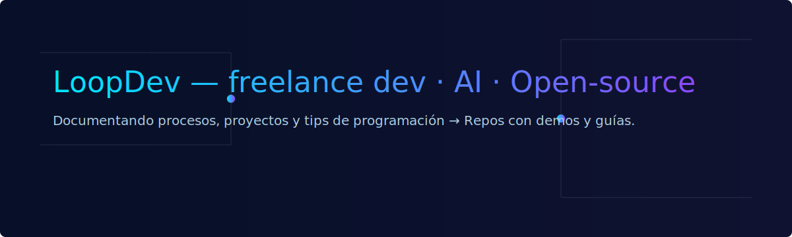

<!-- Banner -->

# 👋 Hola — soy **LoopDev**
Desarrollador freelance · aprendiz constante en IA · comparto tips, proyectos y el proceso detrás del código.

**Lo que hago:** backend, frontend, herramientas AI, bots y microservicios.  
**Stack:** Node.js · Python · FastAPI · JavaScript · React · Docker · GitHub Actions · ML basics.

---

## ⭐ Proyectos destacados
- **[project-name-1](https://github.com/USERNAME/project-name-1)** — One-liner + badge.  
- **[project-name-2](https://github.com/USERNAME/project-name-2)** — One-liner + demo link.

---

## 🔧 Herramientas & badges

---

## 📺 Últimos videos / mini-vlogs
<!-- LATEST_VIDEOS_START -->
<!-- (Se actualiza automáticamente con Actions) -->
- *Video de ejemplo* — [Cómo integré Copilot en mi flujo de trabajo](https://youtube.com/...)
<!-- LATEST_VIDEOS_END -->

---

## 📫 Contáctame
- Twitter / X: [@LoopDev](https://twitter.com/LoopDev)  
- YouTube: [LoopDev Channel](https://youtube.com/...)  
- Email: nombre@ejemplo.com

---

> Si te interesa colaborar, abrir un issue o decir “hola”, ¡estaré encantado!
